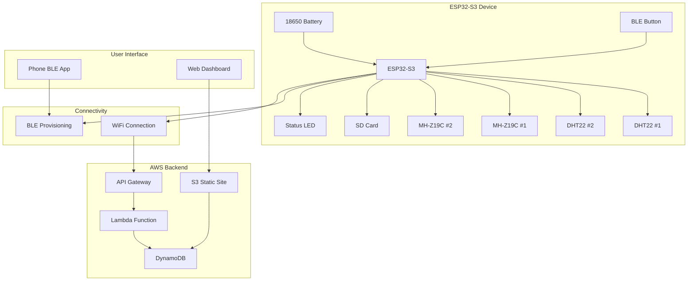
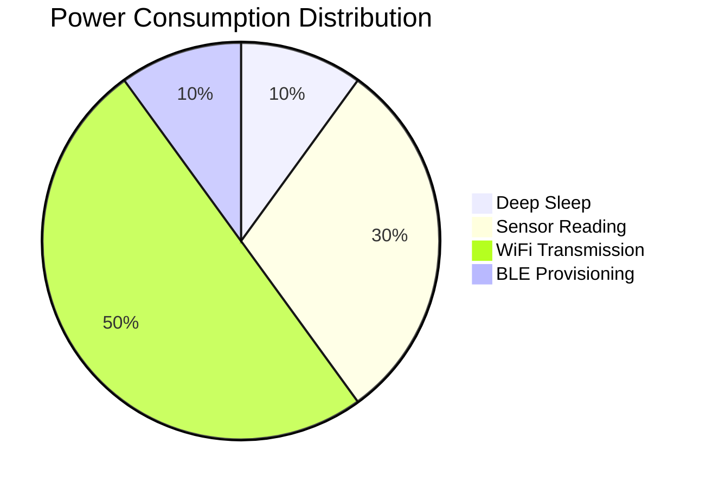
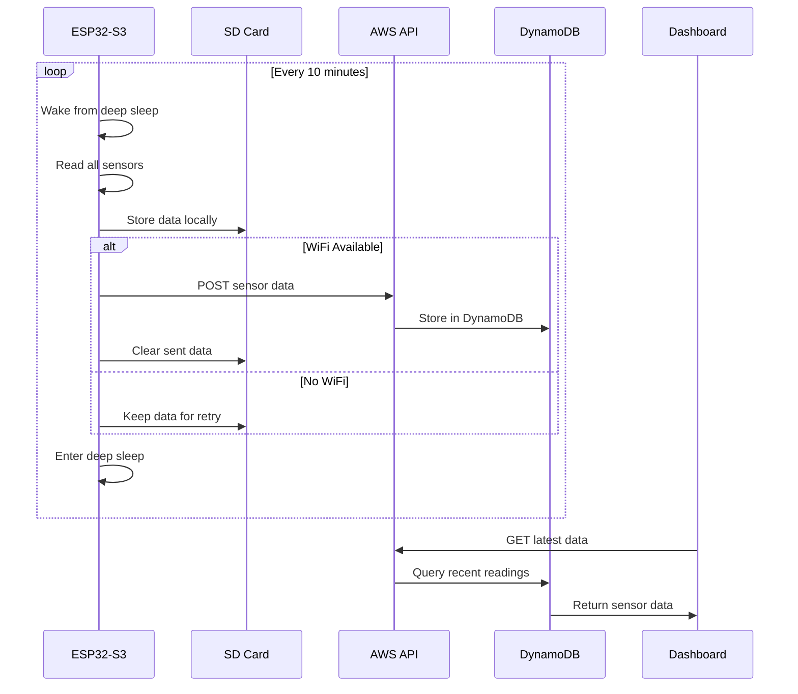
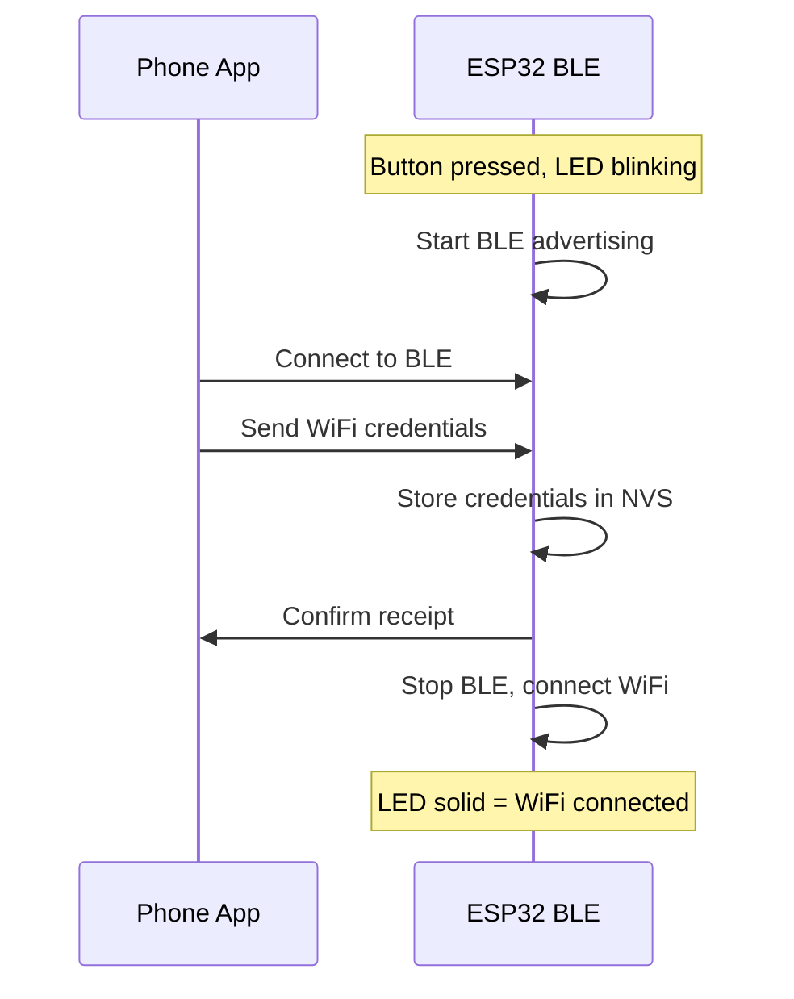

# Technical Specifications

## System Architecture



## Hardware Specifications

### ESP32-S3 Configuration
- **MCU**: ESP32-S3 (dual-core, WiFi + BLE)
- **Flash**: 4MB minimum
- **RAM**: 512KB SRAM
- **GPIO Requirements**: 8 pins (4 sensors + SD + LED + Button + spare)

### Sensor Specifications

| Component | Interface | Power | Range | Accuracy |
|-----------|-----------|-------|-------|----------|
| DHT22 | 1-Wire | 3.3V, 2.5mA | -40°C to 80°C, 0-100% RH | ±0.5°C, ±2% RH |
| MH-Z19C | UART | 5V, 150mA | 400-5000 ppm CO2 | ±(50ppm+5%) |
| SD Card | SPI | 3.3V, 100mA | 1GB storage | - |

### Power Analysis



**Power Calculations**:
- Deep sleep: 10µA
- Active (sensors): 200mA for 30s every 10min
- WiFi transmission: 300mA for 5s every 10min
- **Average consumption**: ~15mA
- **18650 battery (3000mAh)**: ~8 days runtime

## Data Flow Architecture



## Data Format

### Sensor Data Structure
```json
{
  "device_id": "esp32_classroom_01",
  "timestamp": "2025-01-10T22:30:00Z",
  "sensors": {
    "temperature_1": 23.5,
    "humidity_1": 45.2,
    "temperature_2": 23.8,
    "humidity_2": 44.9,
    "co2_1": 850,
    "co2_2": 870
  },
  "battery_voltage": 3.7,
  "wifi_rssi": -65
}
```

### SD Card Storage Format
- **File**: `YYYYMMDD.json` (daily files)
- **Structure**: One JSON object per line
- **Retention**: 7 days, auto-cleanup

## Pin Configuration

| Pin | Function | Component |
|-----|----------|-----------|
| GPIO4 | Data | DHT22 #1 |
| GPIO5 | Data | DHT22 #2 |
| GPIO16 | UART TX | MH-Z19C #1 |
| GPIO17 | UART RX | MH-Z19C #1 |
| GPIO18 | UART TX | MH-Z19C #2 |
| GPIO19 | UART RX | MH-Z19C #2 |
| GPIO23 | MOSI | SD Card |
| GPIO19 | MISO | SD Card |
| GPIO18 | SCK | SD Card |
| GPIO5 | CS | SD Card |
| GPIO2 | Output | Status LED |
| GPIO0 | Input | BLE Button |

## AWS Infrastructure

### API Gateway Endpoint
```
POST /sensor-data
Authorization: API Key
Content-Type: application/json
```

### DynamoDB Schema
```
Table: sensor_readings
Partition Key: device_id (String)
Sort Key: timestamp (String)
Attributes: sensor_data (Map), battery_voltage (Number), wifi_rssi (Number)
```

### Lambda Function (Minimal)
```python
import json
import boto3
from datetime import datetime

def lambda_handler(event, context):
    dynamodb = boto3.resource('dynamodb')
    table = dynamodb.Table('sensor_readings')
    
    data = json.loads(event['body'])
    data['timestamp'] = datetime.utcnow().isoformat()
    
    table.put_item(Item=data)
    
    return {
        'statusCode': 200,
        'body': json.dumps({'status': 'success'})
    }
```

## BLE Provisioning Protocol



## Performance Requirements

- **Data transmission interval**: 10 minutes
- **Sensor reading time**: < 30 seconds
- **WiFi connection time**: < 10 seconds
- **BLE provisioning timeout**: 5 minutes
- **Battery life target**: 7+ days
- **Data accuracy**: ±5% for all sensors
